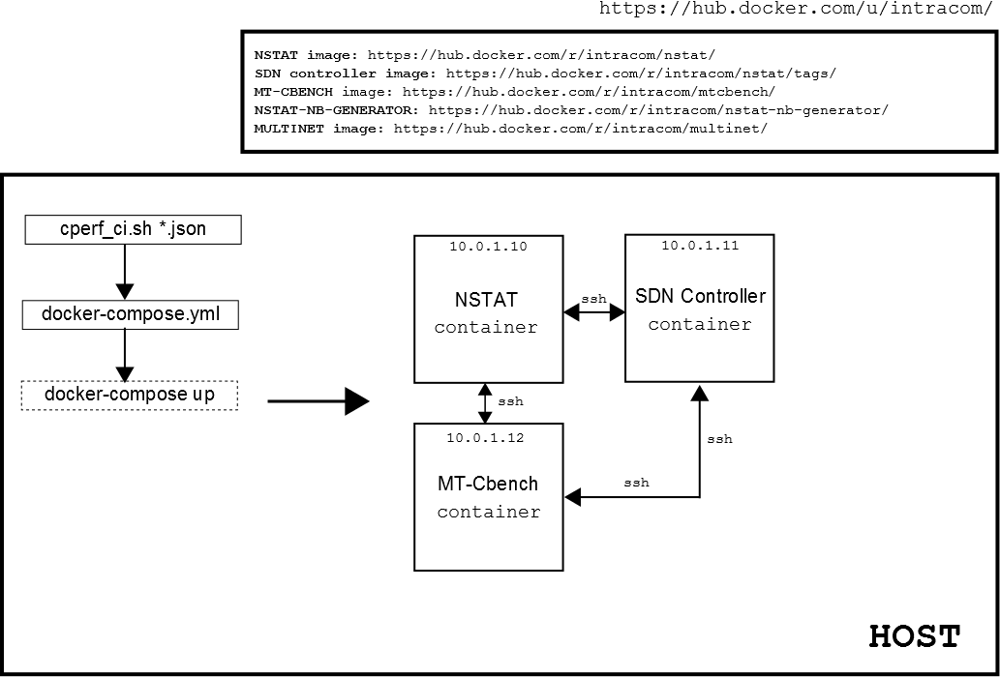

[](https://codeclimate.com/github/intracom-telecom-sdn/nstat-cperf)

# NSTAT: Automated stress tests for OPFNV/Cperf project

## Overview
The repository contains scripts for automatically running all SDN controller
performance [stress tests](https://github.com/intracom-telecom-sdn/nstat/wiki)
with the aid of the [NSTAT](https://github.com/intracom-telecom-sdn/nstat)
suite. At the moment json input files are provided for two different versions
of the OpenDaylight controller, Beryllium and Boron SR1. These files are stored
under

```bash
./beryllium
./boron
```
directories. For running the tests on a host machine, the tools and the steps
below should be installed and followed.

## Essential tools

- [docker](https://docs.docker.com/engine/installation/) (v.1.12.1 or later)
- [docker-compose](https://docs.docker.com/compose/install/) (v.1.8.0 or later)

## Installation

For running the tests, clone the [NSTAT:OPFNV/Cperf](https://github.com/intracom-telecom-sdn/nstat-cperf#nstat-automated-stress-tests-for-opfnvcperf-project)
on the host machine.

-  Step 1
```bash
git clone --branch v1.0 https://github.com/intracom-telecom-sdn/nstat-cperf.git nstat-cperf
```

-  Step 2
Give read/write/execute permissions for any user in /opt
```bash
chmod 777 -R /opt
```
-  Step 3

Give non-root access to docker daemon

* Add the docker group if it doesn't already exist
sudo groupadd docker

* Add the connected user "${USER}" to the docker group. Change the user name to
match your preferred user

```bash
sudo gpasswd -a ${USER} docker
```

* Restart the Docker daemon:
```bash
sudo service docker restart
```
-  Step 4

Make the following system configuration parameters on the host machine by editing
the system files as mentioned below

-  ```/etc/security/limits.conf```

  *  soft nofile 1000000
  *  hard nofile 1000000

-  ```/etc/sysctl.conf ```

  *  net.ipv4.ip_forward = 1
  *  kernel.nmi_watchdog=0
  *  kernel.pty.max = 4096
  *  fs.file-max = 26233259
  *  net.core.wmem_max = 12582912
  *  net.core.rmem_max = 12582912

## Run the tests

The tests below point to the OpenDaylight Boron controller version. It is recommmended
to start with __Functional testing__, since no intensive memory resources are required.
8Gb RAM memory (minimum) on the host machine is recommended. Funtional tests
run end to end producing finally the stress test report in HTML form. Once the
user becomes familiar with Functional testing, __Stress testing__ is nothing more
than having the same input json files but with greater dimensions. This can be
validated by looking at the diffs between ie.the json input files


### Functional testing

- [Flow scalability test with idle Multinet switches](https://github.com/intracom-telecom-sdn/nstat/wiki/Flow-scalability-test-with-idle-Multinet-switches)
  - ./$NSTAT_CPERF_DIR/boron/nb_multinet/cperf_ci.sh boron_nb_active_scalability_multinet.json
- [Switch scalability test with active MT-Cbench switches](https://github.com/intracom-telecom-sdn/nstat/wiki/Switch-scalability-test-with-active-MT-Cbench-switches)
  - ./$NSTAT_CPERF_DIR/boron/sb_mtcbench/cperf_ci.sh boron_DS_sb_active_scalability_mtcbench.json
  - ./$NSTAT_CPERF_DIR/boron/sb_mtcbench/cperf_ci.sh boron_RPC_sb_active_scalability_mtcbench.json
- [Controller stability test with active MT-Cbench switches](https://github.com/intracom-telecom-sdn/nstat/wiki/Controller-stability-test-with-active-MT-Cbench-switches)
  - ./$NSTAT_CPERF_DIR/boron/sb_mtcbench/cperf_ci.sh boron_DS_sb_active_stability_mtcbench.json
  - ./$NSTAT_CPERF_DIR/boron/sb_mtcbench/cperf_ci.sh boron_RPC_sb_active_stability_mtcbench.json
- [Switch scalability test with idle MT-Cbench switches](https://github.com/intracom-telecom-sdn/nstat/wiki/Switch-scalability-test-with-idle-MT-Cbench-switches)
  - ./$NSTAT_CPERF_DIR/boron/sb_mtcbench/cperf_ci.sh boron_DS_sb_idle_scalability_mtcbench.json
  - ./$NSTAT_CPERF_DIR/boron/sb_mtcbench/cperf_ci.sh boron_RPC_sb_idle_scalability_mtcbench.json
- [Switch scalability test with active Multinet switches](https://github.com/intracom-telecom-sdn/nstat/wiki/Switch-scalability-test-with-active-Multinet-switches)
  - ./$NSTAT_CPERF_DIR/boron/sb_multinet/cperf_ci.sh boron_sb_active_scalability_multinet.json
- [Switch scalability test with idle Multinet switches](https://github.com/intracom-telecom-sdn/nstat/wiki/Switch-scalability-test-with-idle-Multinet-switches)
  - ./$NSTAT_CPERF_DIR/boron/sb_multinet/cperf_ci.sh boron_sb_idle_scalability_multinet.json
- [Controller stability test with idle Multinet switches](https://github.com/intracom-telecom-sdn/nstat/wiki/Controller-stability-test-with-idle-Multinet-switches)
  - ./$NSTAT_CPERF_DIR/boron/sb_multinet/cperf_ci.sh boron_sb_idle_stability_multinet.json

### Stress testing

- [Flow scalability test with idle Multinet switches](https://github.com/intracom-telecom-sdn/nstat/wiki/Flow-scalability-test-with-idle-Multinet-switches)
  - ./$NSTAT_CPERF_DIR/boron_stress/nb_multinet/cperf_ci.sh boron_nb_active_scalability_multinet.json
- [Switch scalability test with active MT-Cbench switches](https://github.com/intracom-telecom-sdn/nstat/wiki/Switch-scalability-test-with-active-MT-Cbench-switches)
  - ./$NSTAT_CPERF_DIR/boron_stress/sb_mtcbench/cperf_ci.sh boron_DS_sb_active_scalability_mtcbench.json
  - ./$NSTAT_CPERF_DIR/boron_stress/sb_mtcbench/cperf_ci.sh boron_RPC_sb_active_scalability_mtcbench.json
- [Controller stability test with active MT-Cbench switches](https://github.com/intracom-telecom-sdn/nstat/wiki/Controller-stability-test-with-active-MT-Cbench-switches)
  - ./$NSTAT_CPERF_DIR/boron_stress/sb_mtcbench/cperf_ci.sh boron_DS_sb_active_stability_mtcbench.json
  - ./$NSTAT_CPERF_DIR/boron_stress/sb_mtcbench/cperf_ci.sh boron_RPC_sb_active_stability_mtcbench.json
- [Switch scalability test with idle MT-Cbench switches](https://github.com/intracom-telecom-sdn/nstat/wiki/Switch-scalability-test-with-idle-MT-Cbench-switches)
  - ./$NSTAT_CPERF_DIR/boron_stress/sb_mtcbench/cperf_ci.sh boron_DS_sb_idle_scalability_mtcbench.json
  - ./$NSTAT_CPERF_DIR/boron_stress/sb_mtcbench/cperf_ci.sh boron_RPC_sb_idle_scalability_mtcbench.json
- [Switch scalability test with active Multinet switches](https://github.com/intracom-telecom-sdn/nstat/wiki/Switch-scalability-test-with-active-Multinet-switches)
  - ./$NSTAT_CPERF_DIR/boron_stress/sb_multinet/cperf_ci.sh boron_sb_active_scalability_multinet.json
- [Switch scalability test with idle Multinet switches](https://github.com/intracom-telecom-sdn/nstat/wiki/Switch-scalability-test-with-idle-Multinet-switches)
  - ./$NSTAT_CPERF_DIR/boron_stress/sb_multinet/cperf_ci.sh boron_sb_idle_scalability_multinet.json
- [Controller stability test with idle Multinet switches](https://github.com/intracom-telecom-sdn/nstat/wiki/Controller-stability-test-with-idle-Multinet-switches)
  - ./$NSTAT_CPERF_DIR/boron_stress/sb_multinet/cperf_ci.sh boron_sb_idle_stability_multinet.json


### Test execution sequence

An exeample of a test execution sequence is shown in the figure below.

Every cperf_ci.sh script and given the aforementioned ```*.json``` file will deploy
the proper number of containers as defined in ```docker-compose.yml``` file.

For example the ```docker-compose.yml``` located under ```/boron/sb_mtcbehch```
defines three containers

  -  ```nstat```,
  -  ```controller```,
  -  ```mtcbench```

which will be created out of the

  -  ```intracom/nstat:proxy```
  -  ```intracom/nstat:controller_pb_proxy```
  -  ```intracom/mtcbench:proxy```

images. These images are prebuilt, and located
under [hub.dockerhub/intracom](https://hub.docker.com/u/intracom/). All containers
are interconnected with IPs defined within the ```docker-compose.yml```.

Once the docker containers are up and running, the test input ```*.json``` is copied
on to the NSTAT container

```bash
docker cp $CONFIG_FILENAME.json nstat:$NSTAT_WORKSPACE
```
and a ```docker-exec``` command follows

```bash
docker exec -i nstat /bin/bash -c
...
```
which will execute the proper test. Once the test is over, the results folder
is copied back to the ```HOST``` and all containers are killed. The user can
then navigate to the ```RESULTS_DIR``` directory to check all test results.
Parameters ```NSTAT_WORKSPACE, RESULTS_DIR``` are defined within the
```cperf_ci.sh``` script.




## Contact and Support

For issues regarding NSTAT, please use the [issue tracking](https://github.com/intracom-telecom-sdn/nstat/issues) section.
For any other questions and feedback, contact us at [nstat-support@intracom-telecom.com](mailto:nstat-support@intracom-telecom.com).

